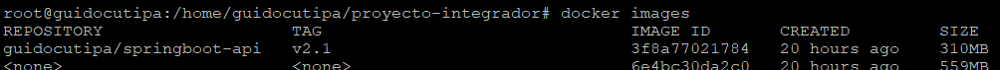
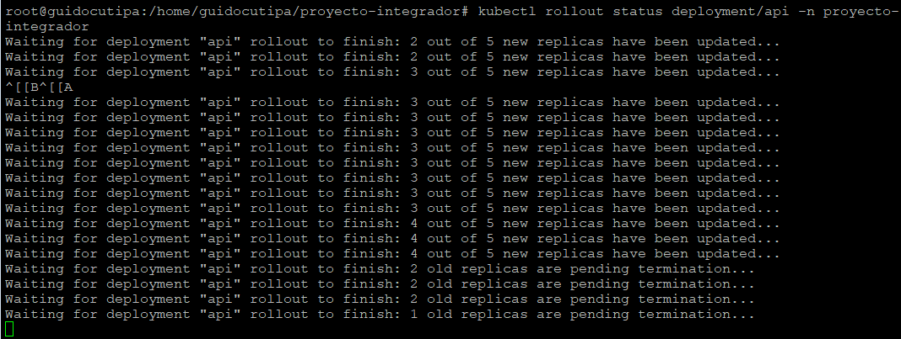

# Proyecto Final - Docker & Kubernetes

**Alumno:** GUIDO CUTIPA YUJRA
**Fecha:** 2025-10-31
**Curso:** Docker & Kubernetes - i-Quattro

## Links de Docker Hub
- Backend v2.1: https://hub.docker.com/r/guidocutipa/springboot-api/tags
- Frontend v2.2: https://hub.docker.com/r/guidocutipa/angular-frontend/tags

## Parte 1: Setup del Ambiente

**Ambiente utilizado:**
- [VirtualBox]
- Nombre de VM/Instancia: [guido-cutipa-yujra-k8s]
- Sistema operativo: Ubuntu 24.04 LTS
- Recursos: 12GB RAM, 3 CPU cores
- Red configurada: [Bridged]
- Rango MetalLB: [192.168.100.100-192.168.100.110]

### Screenshots

- Screenshot de `microk8s status` mostrando todos los addons habilitados (debe verse el hostname con tu nombre)

- Screenshot de `kubectl get all -n proyecto-integrador` mostrando todos los pods Running (terminal con hostname visible)

- Screenshot del navegador accediendo al frontend via IP de MetalLB

- Screenshot de la configuración de la VM (VirtualBox) mostrando el nombre con tu nombre completo

## Parte 2: Backend v2.1

*Como la instrucción decía agregar y no sustituir el endpoint* he modificado el nombre del endpoint debido a que estaba duplicado con otro existente

mi nuevo endpoint se llama "/api/*getinfo*"

### Código Agregado

### Screenshots

- Screenshot de `docker images` mostrando la imagen v2.1

- Link a tu imagen en Docker Hub:

[https://hub.docker.com/r/guidocutipa/springboot-api/tags](https://hub.docker.com/r/guidocutipa/springboot-api/tags)

- Screenshot de `kubectl rollout status` durante la actualización

- Screenshot de `kubectl get pods` mostrando los pods con la nueva versión

- Screenshot o output de `curl http://127.0.0.1/api/getinfo` mostrando la respuesta JSON

*Tuve que realizar varios intentos hasta que por fin se recreo el pod y respondió el nuevo enpoint creado*

## Parte 3: Frontend v2.2

Código modificado de Angular (screenshots de .html y .ts)

### Screenshots

- Código modificado de Angular (screenshots de .html y .ts)

- Link a tu imagen en Docker Hub: `https://hub.docker.com/r/guidocutipa/angular-frontend/tags`

- Screenshot de `kubectl get pods -w` durante el rolling update del frontend

- Screenshot del navegador mostrando el botón "Ver Info del Sistema"

- Screenshot del navegador mostrando la información del sistema cargada

## Parte 4: Gestión de Versiones

### ¿Qué hace kubectl rollout undo?

Revierte un Deployment al ReplicaSet anterior registrado en su historial, deshaciendo el último rollout.

### Screenshots

- Screenshot de `kubectl rollout history` del backend

- Screenshot de `kubectl rollout history` del frontend

- Screenshot del proceso de rollback (undo)

- Screenshot verificando que `/api/info` dejó de funcionar después del rollback

- Screenshot del rollforward (undo --to-revision=2)

la revision 2 se elimino en el anterior paso por lo que no se pudo hacer rollback a la revision 2

en su lugar se hizo rollback a la revisión 4

- Screenshot verificando que `/api/info` volvió a funcionar

## Parte 5: Ingress + MetalLB

**IP del Ingress:** 192.168.100.71

### Screenshots

- Screenshot de `kubectl get ingress` mostrando la IP asignada

- Screenshot de `kubectl describe ingress` mostrando las rutas configuradas

- Screenshot del navegador accediendo a `http://192.168.100.71/` (frontend)

- Screenshot de curl a `/api/getinfo` desde la IP de MetalLB

- Screenshot de curl a `/actuator/health` mostrando status UP

## Conclusiones

### Aprendizajes principales
- *Parte 1*

1. La configuración de red (rango MetalLB y modo de la VM) es crítica para acceso externo.
2. Documentar con screenshots y hostname es imprescindible para validación.
3. Verificación básica (status, describe, logs) resuelve la mayoría de fallos iniciales.

- *Parte 2*

1. Usar tags únicos para imágenes y automatizar versionado.
2. Ver logs y describe para diagnosticar pull/CrashLoop.
3. Probar localmente el endpoint antes de construir la imagen.
4. Entender caché de imágenes en microk8s y cómo forzar actualización.

### Dificultades encontradas
- no pude compilar el proyecto base desde el inicio en ubuntu desktop por lo que tuve que instalar ubuntu server en una maquina virtual y ahi si pude compilar el proyecto sin errores.
- la imagen del frontend no se actualizaba en kubernetes a pesar de hacer build y push de la nueva version, tuve que eliminar manualmente la imagen y forzar la descarga 

### Reflexión
[¿Cómo aplicarías esto en un proyecto real?]